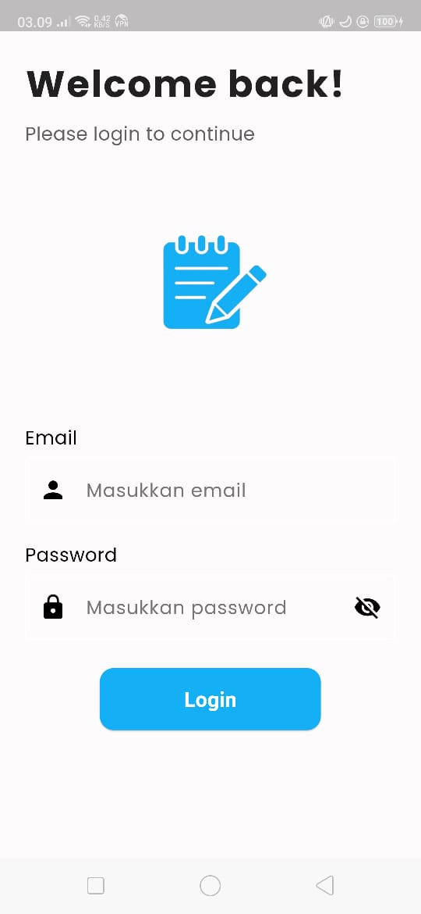
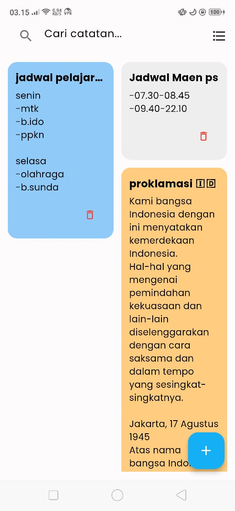
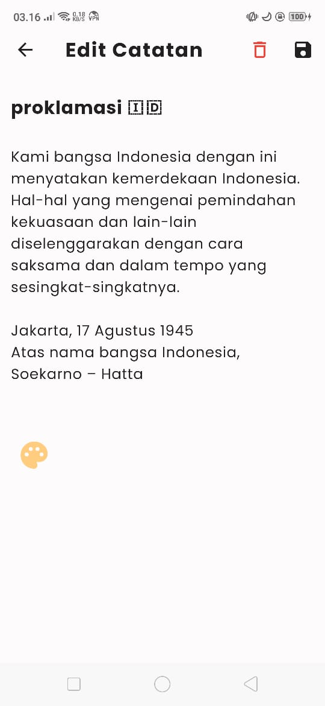

# 📝 My Notes App

A simple yet elegant Flutter note-taking app with a beautiful UI. Easily create, edit, delete, and color-code your notes. Notes are stored locally using SQLite for offline access.

## ✨ Features

- Add, edit, and delete notes
- Custom background colors for notes
- Toggle between grid and list views
- Smooth animations and clean user interface
- Search notes instantly
- Local data persistence using SQLite

## 🚀 Getting Started

Follow these steps to get the app up and running on your local machine:

1. Clone the repository:

   ```bash
   git clone https://github.com/Jejekdf/My_Notes.git

2. Navigate to the project directory

    ```bash
    cd My_Notes

3. Install dependencies

    ```bash
    flutter pub get

4. Run the app

    ```bash
    flutter run

## 🛠️ Built With

- **Flutter** – UI toolkit for building natively compiled apps  
- **SQLite** – Local database for offline data storage  
- **flutter_staggered_grid_view** – For dynamic grid layouts  
- **flutter_launcher_icons** – For generating app icons automatically


## 📱 Screenshots

### 🔐 Login Page


### 🏠 Home Page


### ✏️ Edit Note


